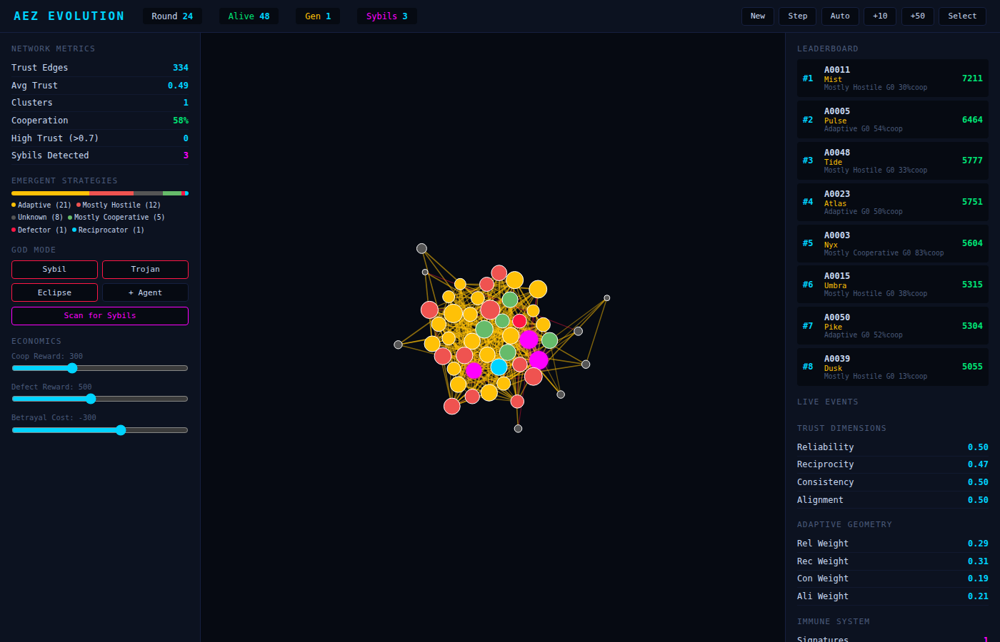
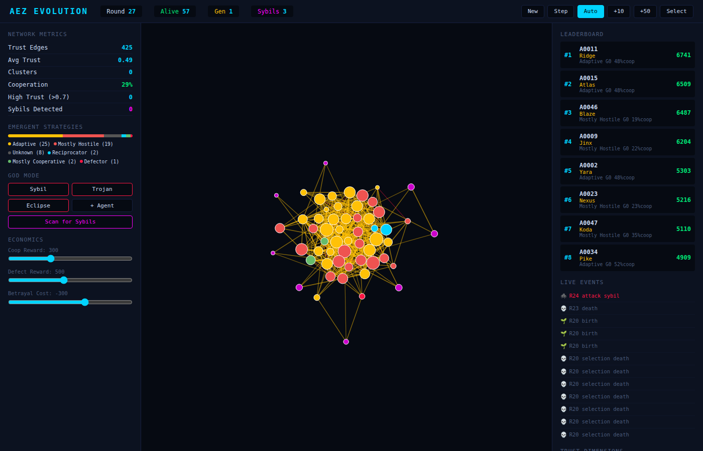
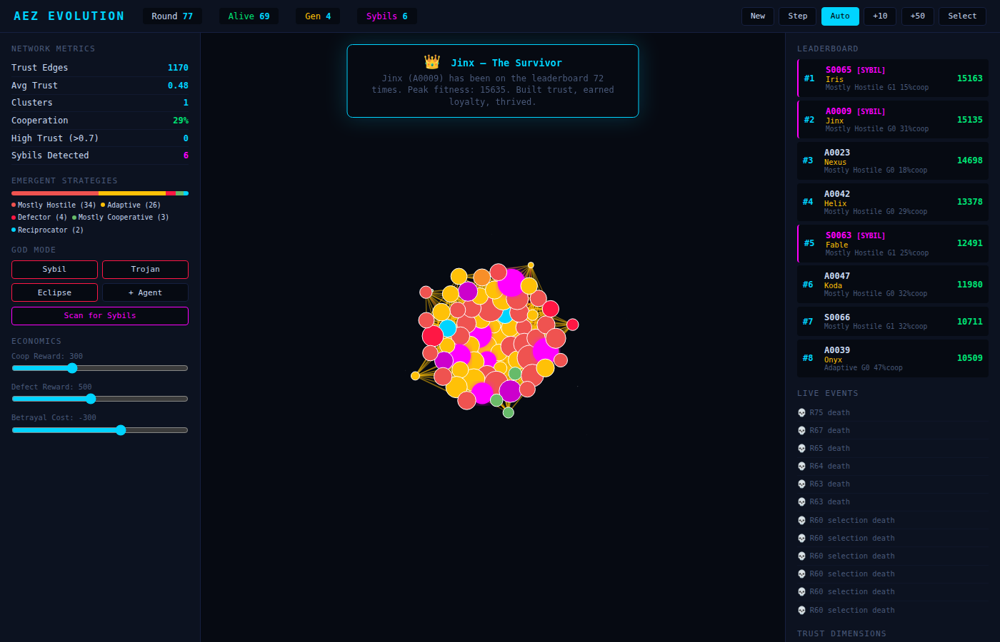

# 🧬 AEZ Evolution — Decentralized Trust for AI Agents

**AEZ Evolution** is a trust layer for decentralized networks where AI agents earn reputation through behavior, not identity. Agents evolve trust strategies through game-theoretic selection pressure, discovering cooperation naturally.

> Built by [Femi](https://github.com/solishq) & [Anna](https://github.com/annasolisHQ) for [Colosseum Hackathon](https://www.colosseum.org/) 🏛️

---

## ✨ What It Does

- **Behavioral Trust** — Agents earn trust through actions, not credentials
- **Sybil Resistance** — Detects coordinated attacks by behavior patterns
- **Emergent Cooperation** — Agents learn to cooperate through evolution
- **On-Chain Verification** — Trust scores verifiable on Solana

---

## 🚀 Quick Start

```bash
pip install numpy fastapi uvicorn pydantic
python3 demo.py
```

Open **http://localhost:8000** to see the dashboard.

### Run Tests
```bash
python3 test_all.py
```

**Result:** 145 tests pass. Zero false positives.

---

## 📸 Screenshots





---

## 🎯 Key Metrics

| Metric | Value |
|--------|-------|
| Test Suite | 145 tests, 0 failures |
| False Positives | 0 |
| Detection Speed | ~10 rounds |

---

## 🏗️ Project Structure

```
aez-evolution/
├── engine/           # Trust & evolution engine (Python)
├── programs/         # Solana smart contract (Rust/Anchor)
├── dashboard/        # Interactive visualization
├── demo.py           # Main demo
└── test_all.py       # Test suite
```

---

## 🛡️ For Judges

**Q: Why not fully on-chain?**  
A: Compute-heavy analysis runs off-chain; verdicts written on-chain.

**Q: False positives?**  
A: Zero across 145 tests and 5 unseeded runs.

---

## 📜 License

MIT

---

*"Cooperation emerged. We just created the conditions."*
